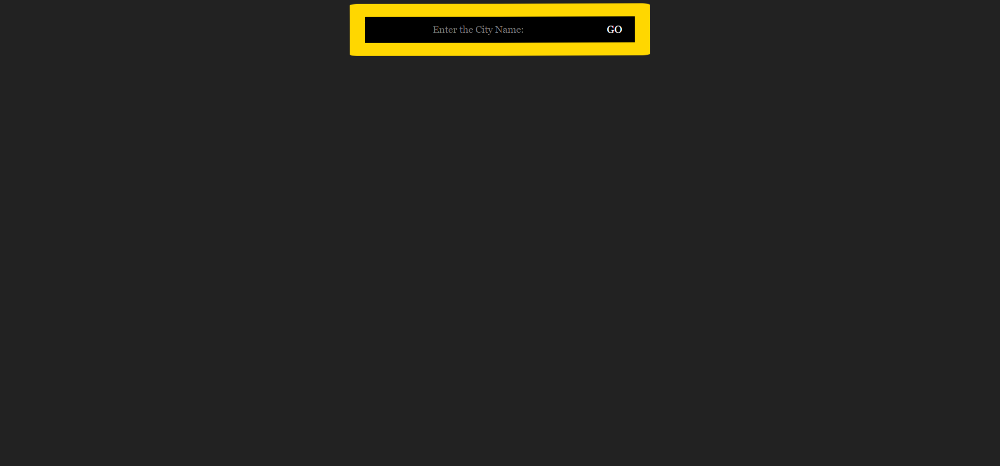
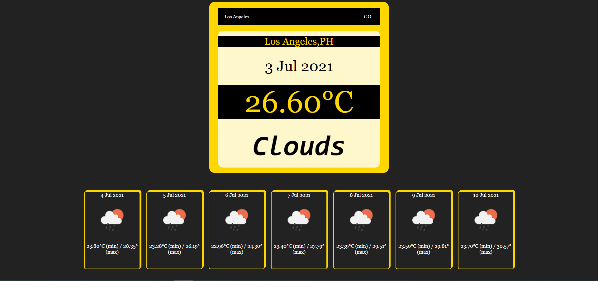

<h1>Weather Forecast Website</h1>
A simple weather app built with HTML , CSS and JS and deployed on netlify.
<h1>Features</h1>
<ul>
  <li>Responsive UI</li>
  <li>Get current Weather of any city.</li>
  <li>Next one week weather forecast is displayed.</li> 
</ul>
<h1>API</h1>
Weather data is retrieved from <a href="http://openweathermap.org/">http://openweathermap.org/</a>
 
<h2>You can view the site here: <a target="_blank" href="http://webweatherforecast.netlify.app/">webweatherforecast.netlify.app</a></h2>
<h2>Images</h2>
<h4>You can Enter City Name: </h4>
<h1></h1>
<h4>You can see the next seven days weather forecast data-</h4>
 

Made with ❤️ by shubham garg
